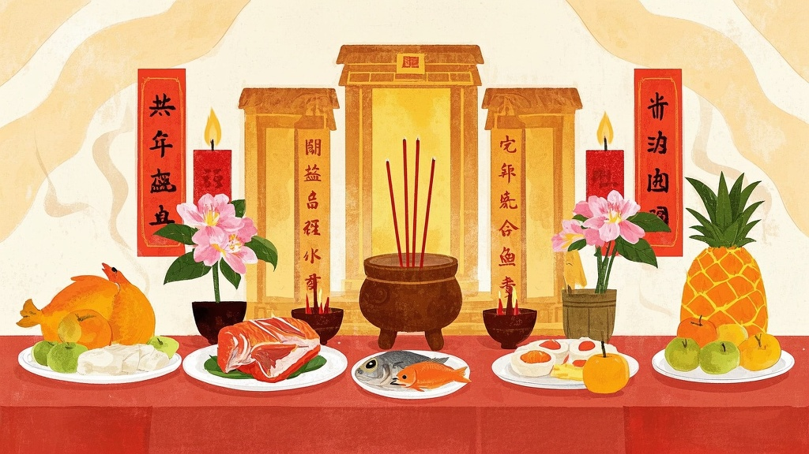
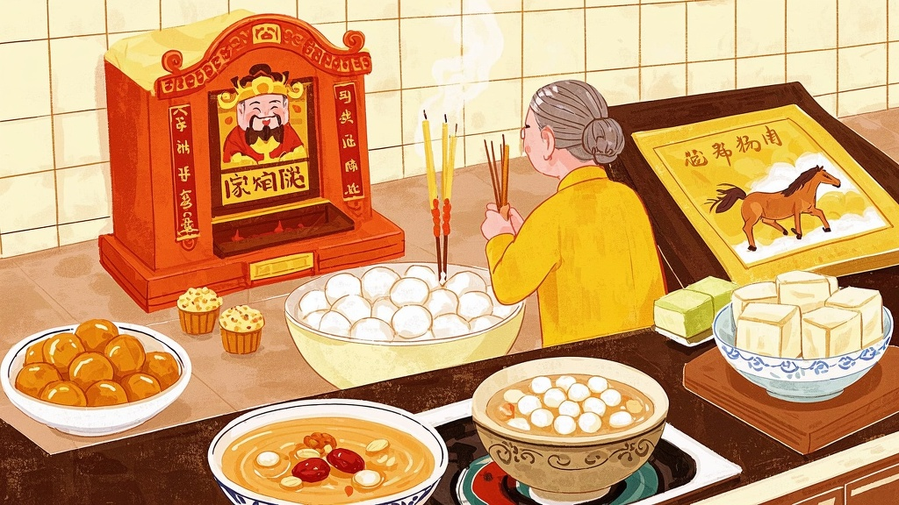
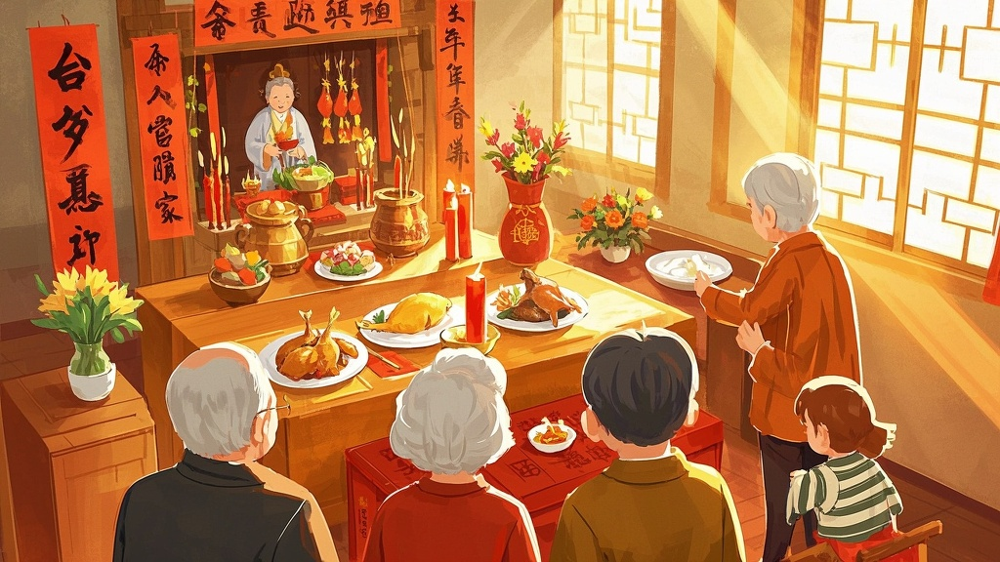
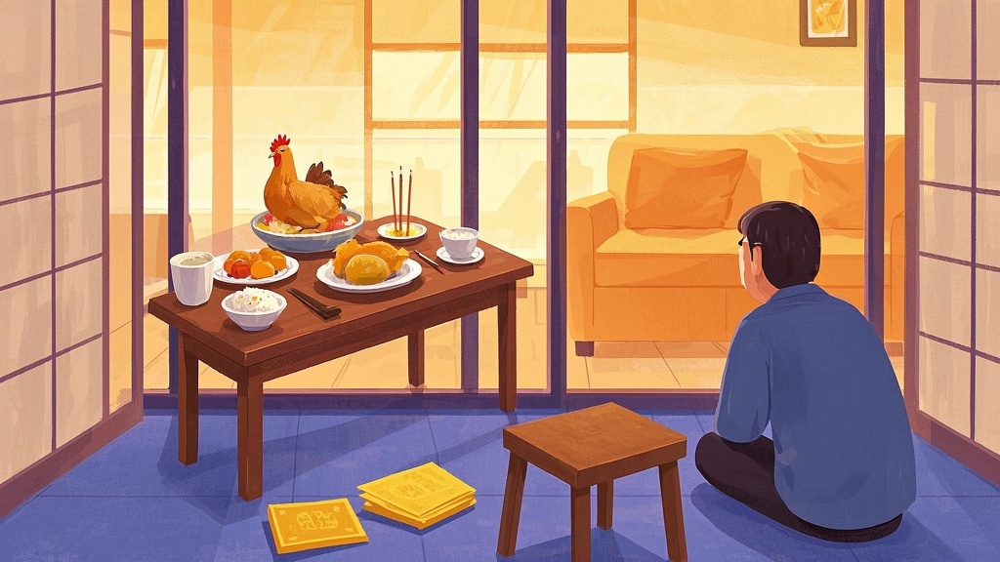
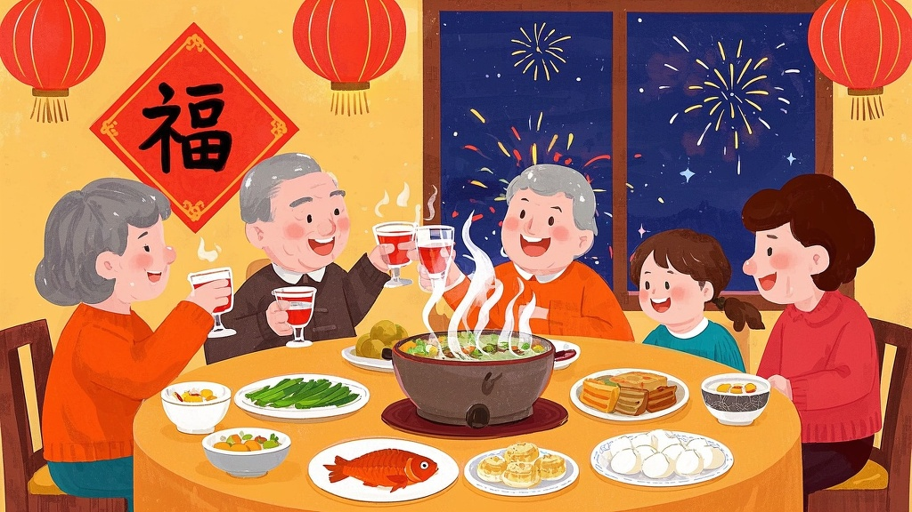
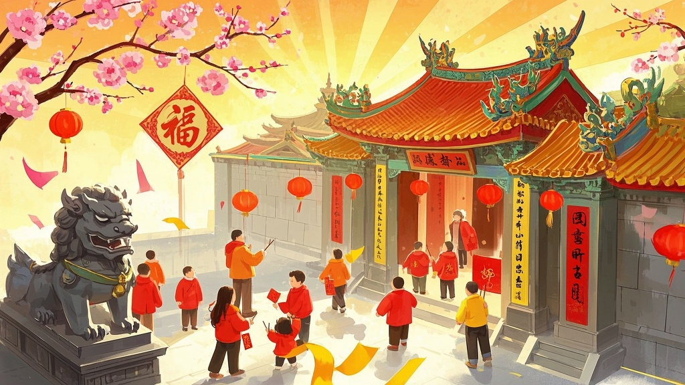
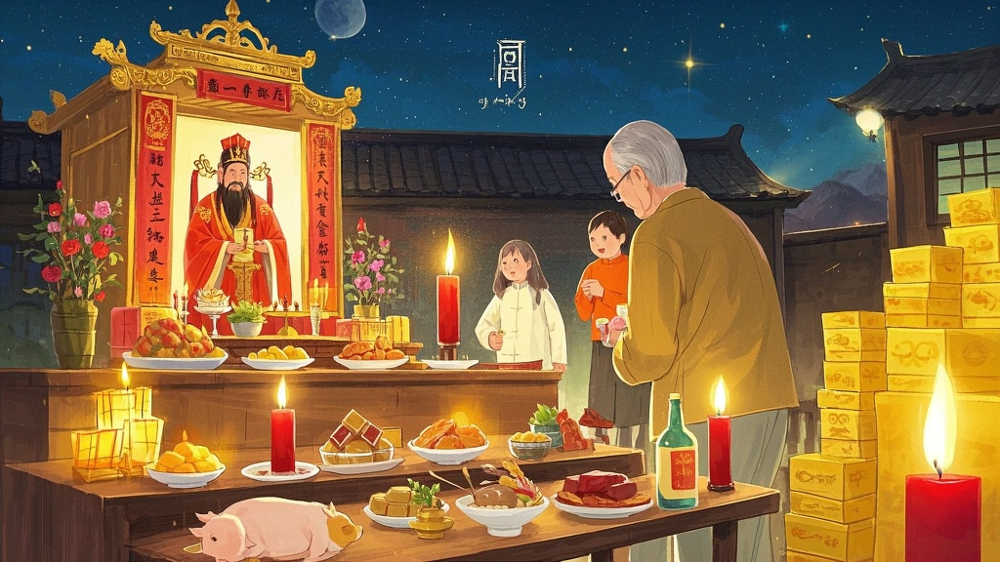
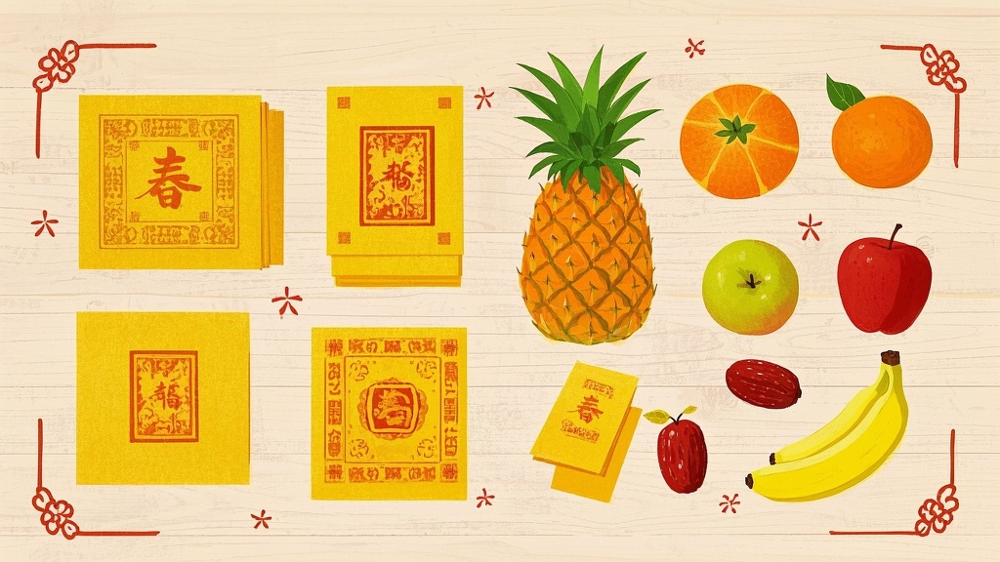

# 台灣農曆新年怎麼拜？從送神到天公生，完整祭祀流程、供品、禁忌一次看

過年要拜幾次？每次拜誰？供品要準備什麼？金紙怎麼燒？這些問題每到年節就會被翻出來問一輪。其實台灣的過年祭祀沒有想像中複雜，只要搞清楚「什麼時候拜、拜誰、準備什麼」，照著走就不會出錯。

這篇把從臘月二十四送神到正月初九天公生的完整祭祀流程整理好了，每一個環節的時間、供品、金紙、注意事項都寫清楚，存起來過年直接用。

> **提醒：** 以下整理的是台灣常見的一種作法，各地廟宇、家族之間的習慣可能不盡相同。如果家裡有自己傳承的規矩，以長輩的教法為準——畢竟拜拜這件事，心誠則靈，沒有標準答案。

---

## 過年祭祀行事曆，先看懂整個時間軸

農曆新年的祭祀不是只有除夕那一天。從送神開始算，前前後後大約橫跨半個月：

- **臘月二十四**：送神日（送眾神回天庭）
- **送神後～除夕前**：清囤大掃除
- **除夕**：拜眾神、拜祖先、拜地基主、圍爐守歲
- **初一**：開正拜神明（行春）
- **初四**：接神（迎眾神回家）
- **初五**：破五、開工拜拜（財神爺生日）
- **初九**：天公生（玉皇大帝聖誕）

每一個節點該怎麼拜，下面一個一個說。

---

## 送神日怎麼拜？為什麼要給灶神吃甜的？

農曆十二月二十四日是「送神日」。跟大陸主要送灶王爺不同，不少台灣家庭會把家中供奉的神明一起送回天庭述職——哪些神明要送、怎麼送，各地做法不太一樣，但灶神幾乎是一定會送的。口訣是「送神早，接神晚」——送神越早越有誠意。

**時間：** 農曆 12 月 24 日，可以提早到前一晚子時（23:00），最晚不超過中午（13:00 前）。

**供品：** 三牲（豬肉、全魚、全雞）、酒三杯、甜湯圓三碗、四果（四種水果）、鮮花，以及各式甜食——麥芽糖、冬瓜糖、花生糖、龍眼乾、紅棗、麻糬、發粿。

甜食的用意很有趣：灶神要回天庭跟玉皇大帝報告這一年家裡的事，給祂吃甜甜，嘴巴黏黏，上去就少講些壞話。

有些地方還會準備乾草、黃豆或胡蘿蔔，說是給灶神的馬吃的——讓馬吃飽了，路上才跑得快。這個習俗並非每個家庭都有，視各地傳統而定。

**金紙：** 雲馬（甲馬）——長方形黃紙上印有白雲、馬匹、車輛和轎子，是神明返回天庭的交通工具。

### 送神後：清囤大掃除

神明回天庭「休假」了，趁這段期間打掃神明廳、擦拭神桌神龕。平常神明在家，這些地方不能隨意移動，送神後到接神前，是一整年唯一能好好清理的時機。

---

## 除夕怎麼拜？辭年祭祀、供品、流程一次看

除夕是過年祭祀最忙的一天。

「除」字代表「去」、「交替」的意思，所以除夕夜人們要除舊佈新，將舊歲除去，迎接來年新歲。除夕拜拜在台灣稱為「辭年」——感謝眾神和祖先一整年的照顧與庇佑，豐盛的酒菜絕對少不了，要帶著感恩惜福的心情來祭拜。

因為祭祀對象多，除夕可能是過年期間最複雜的一天。各地習俗及對神明的重視程度都有差異，祭拜方式五花八門——一般來說會以**祖先和地基主**為基本，再視家中供奉的神明、天公信仰習慣往上加。有些家庭還會拜床母，端看各地傳統和長輩的交代。

---

### 1、除夕拜天公——吉時、供品、口訣

除夕夜拜天公通常在小年夜跨子時進行，是除夕祭祀中最先進行的一環，因為「天」的位階最高，要比拜家神、祖先和地基主更早祭拜以示尊敬。

一般民間多認為拜天公就是拜「玉皇大帝」。但有道教法師指出，除夕所拜的「天公」其實是**盤古天尊**（元始天尊），而非玉皇大帝——「未有天地，先有盤古」，盤古開天闢地、雙眼化為日月，是天地之前就存在的最高神；道教位階上，三清（元始天尊）也在玉皇大帝之上。玉皇大帝是「天庭的管理者」，盤古天尊才是「天地的創造者」。初九天公生拜的才是玉皇大帝。這個說法不見得每個人都認同，但值得知道。<!-- 資料來源：道教法師訪談 https://www.instagram.com/reel/DUxdKJID87k/?igsh=MWFlMWJzbDF6bXpjcA== -->

地點：家門口朝外擺放供桌與供品，祭拜者由屋內向外行禮。若家中沒有神明廳，也可在門口以簡式方式祭拜。
時間：子時（小年夜 23:00 到凌晨 01:00）為佳
供品：五牲（豬、雞、鴨、魚、蝦等）、水果、年糕、發糕、糖果、鮮花及茶水
金紙：天公金（大百天金）、壽金、四方金、福金

**拜天公口訣（祝禱詞）：** 「天公祖在上，弟子（信女）OOO，住在 OOO，今日除夕辭年，備辦簡單供品禮敬，還請天公笑納，並祈求保佑弟子（信女）OOO 一家平安順利、消災增福。」（各家稱呼不同，有人稱「玉皇大天尊」、有人稱「盤古天尊」，依自家傳統為準。）

**祭拜流程：**
1. 供桌、供品擺放整齊，依時辰燃香祭拜
2. 等香燒到剩約 1/3 的長度，再接續燒金紙（金紙要用天公金）

---

### 2、除夕拜眾神（家神）——吉時、供品

地點：自家神龕前
時間：除夕當天上午，拜完天公之後
供品：鮮花一對、茶三杯、三牲（豬肉、全魚、全雞）、水果三或五樣、年糕、發粿、甜粿、糖果
金紙：四色金（刈金、壽金、福金、大百壽金）
順序：與一般拜神方式相同

若家中有供奉土地公，可在這個時段一起祭拜。

---

### 3、除夕拜祖先（公媽）——吉時、供品、口訣

地點：自家祖先牌位前
時間：中午過後、年夜飯之前。讓祖先先吃飽，後輩才能安心圍爐。如果家裡圍爐時間較早，祭拜也可以相對提前，重點是確保供品是新鮮熱食。
供品：熟三牲、鮮花一對、茶三杯、糖果、菜碗（六碗、八碗或十二碗皆可）、水果、發粿、年糕、碗筷數套（十副象徵十全十美，筷頭朝牌位方向）
金紙：大銀（蓮花金、蓮花銀）或刈金
順序：與一般拜祖先方式相同

**拜祖先口訣（祝禱詞）：** 「今逢歲末，子孫備辦香燭素果、三牲酒禮，敬獻列祖列宗，祈求祖德庇佑，保佑家宅平安、闔家健康、事業順利，子孫昌盛。敬請祖先享用！」若家中有傳承的家族口訣，依長輩教導為準。

**祭拜流程：**
1. 供桌、供品擺放整齊，依時辰燃香祭拜
2. 如有燒金紙，等香燒到剩約 1/3 的長度再接續燒

**注意：** 傳統上供品建議以全熟熱食為主——想想也是，誰會請自家長輩吃冷飯呢？水果方面，不少家庭會避開有籽的（如芭樂、蓮霧、葡萄），認為「多籽」諧音「多心」，拜拜不夠專心。也有長輩認為祭祖時不宜放香蕉、鳳梨、龍眼等象徵「旺來」的水果，因為會「旺到另一邊去」——不過也有人不忌諱這些，各家習慣不同，依長輩的規矩為準。

---

### 4、除夕拜地基主——供品、口訣

地基主是守護住宅的神靈，年輕一輩最容易漏掉的一環。別忘了拜。

地點：廚房面向客廳方向，或從後門朝屋內方向祭拜
時間：拜完眾神之後，中午過後到傍晚。也有人和拜祖先同一時間進行。
供品：日常飯菜（有菜有飯即可，傳說地基主愛吃雞腿，有雞腿更佳）、水果、茶或酒二杯
碗筷：兩副（地基主公＋地基主婆）。各地區不同，有人只拜地基主而已，請依當地風俗。
供桌：用矮桌或板凳，不用正式供桌。老一輩說地基主個子不高，桌子太高祂吃不到。
金紙：北台灣以刈金、大銀、小銀為主（由大至小依序燒）；南台灣以九金、銀紙、蓮花金、蓮華銀、金白錢及經衣為主。各地習俗不同，可以問金紙店老闆最準。

**拜地基主口訣（祝禱詞）：** 「今天是除夕，弟子（信女）OOO，備妥供品，誠心敬奉地基主公，感謝這一年來的庇佑，讓家宅安穩、家人健康、事事順遂。敬請地基主降臨享用，保佑全家身體健康、出入平安、財運亨通、事業順利。願新的一年家宅平安，萬事如意！」

**祭拜流程：**
1. 供桌、供品擺放整齊，依時辰燃香祭拜
2. 焚燒金紙前，記得在香燒到剩約 1/3 時先「擲筊」，詢問地基主是否「吃飽了」，待得到聖杯、地基主同意後，才可以拿金紙去燒

---

## 除夕拜完之後？圍爐、春聯、守歲，重點行程一次看

拜完辭年，接下來是除夕夜的重頭戲。

### 穿新衣、入夜前洗澡

除夕當天要穿新衣，象徵新年新氣象。另外要在入夜前洗澡，傳統認為過了子時才洗會把好運洗掉。

### 圍爐吃年夜飯

圍爐吃得越久越好，象徵「圓滿長久」。年菜最好都有吉祥寓意：魚代表年年有餘（只吃一半，留頭留尾）、長年菜象徵長命百歲（不可直接咬斷，要整口吞再慢慢嚼）、年菜不要全部吃光（年年有餘）。

### 貼春聯

吃過圍爐，居家整理乾淨，貼上新春聯。傳統上舊春聯要在大掃除時就撕下來，除舊才能佈新。據說春聯由桃符演變而來，功能從原本的畫桃符厭鬼制煞，轉變為亦可招財納福的吉祥物。

### 放飯春花、壓案頭（講究一點的做法）

有些家庭會在神明和祖先神案的花瓶換上鮮花，放置年飯——插紅草花，俗稱「飯春花」。閩南語「春」的諧音與「剩」相同，祈求年年有餘、歲有餘糧。

講究一點的做法，還會擺上年糕三種（發粿、甜粿、菜頭粿）、紅糕仔封、麵線三束（圈紅紙）、甜料（生仁、寸棗、糕仔粒、紅棗、桂圓）、疊柑塔、大柚，疊新的五十元硬幣九枚上放一顆紅棗，取「早發」之意。放到正月初五開假後才撤除，稱為「壓案頭」。這套做法在中南部和傳統大家族中比較常見，北部小家庭不一定會這樣準備。

### 焚辟瘟丹、淨宅

都處理完後，用除穢皂沐浴淨身，換上乾淨新衣物，把大門打開，燃檀香或沉香由內而外淨宅，將屋內邪祟趕出。

### 封財門、守歲

接下來進行「封財門」或「守歲」。守歲要過了十二點才能睡，替長輩添壽，為自己迎好運。
傳統上除夕夜家裡燈火要通明，不要關燈睡覺。古時有「照虛耗」的習俗，點旺宅長明燈驅除穢邪。有的長輩會特別交代從除夕夜開燈之後一直開到初五，初六天亮再關——不過現代家庭大多只要求除夕當晚留燈，至少開小夜燈即可。

### 放搖錢樹——最重要的壓軸

除夕可將松柏枝或銀柳（諧音「銀兩」）插在花瓶中，綴以古錢、元寶、石榴花等飾品，在戌時（19:00-21:00）安置於家中財位，祈求財運亨通。

---

## 初一怎麼拜？開正拜神明，也是禁忌最多的一天

初一是新年第一天，台灣人到廟裡走走拜拜，感謝神明庇佑，俗稱「行春」。

**時間：** 子時（00:00）到午時前（11:00）。

**供品：** 鮮花、水果（單數）、敬神茶或酒三杯、素糕餅。

**常見會避開的水果：** 芭樂（多籽＝多心，且帶「番」字不敬）、牛番茄（「番」字）、釋迦（外形似佛祖）、蓮霧（底部凹陷＝漏財）、檸檬（酸澀不吉利）——不過各地說法不一，有的家庭不特別忌諱。

**推薦拜的水果：** 鳳梨（旺來）、橘子（大吉）、蘋果（平安）、香蕉（招你來）、棗子（吉利）。

---

## 初四怎麼拜？接神日，把眾神迎回家

初四是接神日。確認新年一切順利，才放心把送走的眾神迎回家中奉祀。

**時間：** 中午十二點後到下午五點前。

**供品：** 茶水、鮮花、素果、牲禮（三牲）、甜點、發粿。比較特別的是還要準備一條乾淨的毛巾和一盆清水——幫從天庭長途旅程歸來的神明洗塵接風。

**金紙：** 壽金、刈金、福金、五路財神金、甲馬金紙。

接完神，傍晚迎五路財神。

---

## 初五怎麼拜？破五開工，財神爺生日快樂

初五俗稱「破五」，初一到初四的所有禁忌在這天通通解除。垃圾可以倒了，地可以掃了，衣服可以洗了。

初五也是財神爺的生日，又叫「接財神」或「搶路頭」，是開工拜拜的好日子。

**時間：** 午時（11:00-13:00）。

**供品：** 鮮花一對、紅蠟燭一對、茶或酒三杯、五種水果（鳳梨幾乎必備，台語諧音「旺來」）、發糕、糖果、甜湯圓。

**金紙：** 三色金。

**開工流程：** 老闆帶領全公司人員，每人三炷香，唸祝禱文，燒金紙。拜完還要拜公司的地基主——位置在公司後方，朝前方大廳方向拜。

---

## 初九天公生怎麼拜？比除夕還盛大的祭典

初九是天公生——玉皇大帝的聖誕。在很多長輩心中，天公生的重要程度不輸除夕。

**時間：** 凌晨子時（23:00）到早上七點前。越早拜越有誠意。

**供桌分頂桌和下桌：** 頂桌拜天公本人，用全素供品；下桌拜天公的部屬神明，才用葷食。

**供品：** 五牲（豬、雞、鴨、魚、蝦或其他）、五果（五種水果）、糕點、酒水。

**常見會避開的水果：** 名字帶「番」字的（芭樂、番茄）、釋迦（外形似佛祖）、榴槤（氣味太重）——但各地規矩不完全一致。

---

## 過年金紙怎麼燒？各場合速查

過年拜拜的金紙種類不少，搞不清楚很正常。整理如下：

- **送神**：雲馬（甲馬）
- **除夕拜眾神**：四色金（刈金、壽金、福金、大百壽金）
- **除夕拜祖先**：刈金、銀紙
- **除夕拜地基主**：北部用刈金、大銀、小銀；南部用九金、銀紙、蓮花金等（依當地習俗）
- **初四接神**：壽金、刈金、福金、五路財神金、甲馬
- **初五開工**：三色金

不確定的話，問金紙店老闆最準。他們比任何人都清楚當地的規矩。

---

## 拜拜的時候要注意什麼？祭拜通用禁忌

不管是拜天公、拜祖先還是拜地基主，拜拜過程中有幾件事要留意：

**忌用嘴吹熄香：** 要用手搧熄，不能用嘴吹。
**忌用如廁的手插香：** 插香前手要乾淨。
**忌插香歪斜或拔起重插：** 香要插正，一次到位。拔起來重插被認為是不敬。
**忌用手指指神明：** 祭拜時不可用手指畫神明或言語不敬。
**忌祭拜期間爭吵：** 拜拜時避免與家人發生爭執，才能保佑一家和樂。
**忌供品用苦瓜：** 苦瓜的「苦」字寓意不佳，不適合當供品。

供品的避雷原則大致抓兩類：一是「狀態」——菜餚傳統上以全熟熱食為主，避免冷食或生食；二是「水果」——不少家庭會避開整串的（葡萄、龍眼）、多籽的（芭樂、番茄）、諧音或外型不敬的（釋迦、苦瓜）。不過這些說法各地不一，有的長輩特別在意，也有人不忌諱。若家中有固定的避忌清單，以家族習慣為優先。

---

## 過年禁忌有哪些？常見的都在這裡了

傳統上過年有很多禁忌，下面整理的是民間常見的說法。生活型態已經改變，不見得要硬性遵守，有些長輩很在意、有些家庭早就不管了——知道一下，過年跟長輩聊天也多個話題。

### 除夕禁忌

**忌除夕洗衣服：** 傳統認為除夕洗衣會洗掉好運。不過現代生活型態不同，是否遵從取決於個人習慣。
**忌留舊春聯：** 傳統上會在大掃除時就撕下舊春聯，象徵除舊佈新。
**忌向躺在床上的長輩拜年：** 傳統認為這樣會使長輩整年臥病在床。
**忌帶孝之人來拜年：** 父母亡故尚未出殯或未滿百日者，以及坐月子的產婦，不宜到廟裡上香或到親友家拜年。
**忌打小孩、啼哭、罵人、打架：** 俗稱「歹采頭」（壞的預兆），容易引來小人官非。
**忌說髒話：** 多說吉祥話，為來年帶來好運。
**忌打碎物品：** 代表破運破財。不小心打碎了就立刻說「歲歲（碎碎）平安」化解。
**忌拿剪刀：** 代表會把財運剪掉。
**忌欠錢不還：** 俗話說「欠錢不過年」，傳統上認為過年前要把欠債還清，否則倒楣一整年。
**忌倒污水、倒垃圾：** 據說亂倒會噴濺到路過的神明，使人倒楣。
**忌把年夜飯吃光：** 剩一些象徵財富有餘。魚尤其不能全部吃完，留頭留尾代表年年有餘。
**忌長年菜咬斷：** 長年菜象徵長命百歲，要整口吞再慢慢嚼。
**忌吃藥：** 傳統認為年頭年尾不吃藥，來年身體健康。但有慢性病的人千萬不要擅自停藥。
**忌開箱櫃：** 傳說天亮前不可開箱櫃，才能守住上天給的錢財。
**忌早睡：** 守歲替長輩添壽，過了十二點才睡。
**忌關燈睡覺：** 傳統認為關燈代表來年黯淡無光，至少開小夜燈。

### 初一禁忌（規矩最多的一天）

**忌掃地、倒垃圾：** 傳統上從初一到初五都不掃地，怕把財神掃出門。初五「破五」之後才能掃。
**忌早上洗頭洗澡：** 好運會從頭頂被沖掉。真要洗，改晚上。
**忌初一初二洗衣服：** 這兩天是水神生日，大量用水會沖掉財運。
**忌說「敗」「衰」「輸」「死」「病」：** 新年第一天，只說好話。
**忌睡午覺：** 初一睡午覺，一整年都會懶散。再說隨時有客人來拜年，主人在睡覺不像話。
**忌吃稀飯：** 過去稀飯是窮人家吃的，初一吃稀飯代表一年窮到底。
**忌借錢、討債：** 俗話說：「初一借了別人的錢，一年四季靠外援。」
**忌殺生：** 初一不殺生，避免血光之災。

### 初二禁忌（回娘家）

**中午前要到娘家，** 不留晚餐、不過夜。
**穿著要鮮豔，** 紅色最好，避免全黑或全白（傳統觀念中是喪服的顏色）。
**帶回去的禮物要雙數，** 但避開「四」。
**不在娘家做家事，** 老一輩說女兒回門就是客人，在娘家掃地會把娘家財氣掃光。

### 初三禁忌（赤狗日）

初三是「赤狗日」，赤狗是傳說中的熛怒之神。這天出門容易招來是非口角，大部分台灣人初三都選擇待在家。

### 初五之後

「破五」——所有禁忌解除。但初五當天不借錢不討債（畢竟是財神爺生日）。

---

## 拜拜水果怎麼選？禁忌與推薦一次看

拜拜選水果是一門學問——但老實說，水果禁忌本身分派很多，下面列的是民間常見的幾種說法。有的長輩非常在意，也有人不特別忌諱，各家各廟都有自己的規矩。

**常見會避開的水果（不同地區說法可能不同）：**
- 芭樂：多籽＝多心，且帶「番」字不敬
- 番茄：帶「番」字
- 釋迦：外形似佛祖，不敬
- 蓮霧：底部凹陷＝漏財
- 檸檬：酸澀不吉
- 葡萄：成串＝跟著走（有「招陰」的聯想）
- 榴槤：氣味太重

**推薦拜的：**
- 鳳梨：旺來
- 橘子：大吉
- 蘋果：平安
- 香蕉：招你來
- 棗子/李子：吉利
- 柿子：事事如意
- 柑橘：甘甜圓滿

---

## 除夕拜拜常見問題 Q&A

### 除夕可以提早拜拜嗎？

可以的。雖然傳統上有固定的拜拜時辰，但拜拜最重要的是「誠心誠意」。若有提早拜的需求，可以先向地基主和祖先說明原因，也可以擲筊確認提前的時間是否可行。

### 除夕要拜土地公嗎？

除夕拜土地公的說法較不常見，還是以拜天公、祖先和地基主為主。不過若家中本來就有供奉土地公，可以在拜家神的時段一起祭拜。

### 拜拜的雞可以切嗎？

大部分的民俗說法是不建議切，尤其拜地基主的雞腿要儘量保持完整。

### 三牲一定要準備雞、豬、魚嗎？

現代小家庭準備大魚大肉不一定方便，也有浪費的疑慮。可以用香腸、魷魚乾、雞蛋等代替。近年也有業者推出用糕餅、饅頭做成的「素三牲」，對茹素者或追求便利的家庭是另一個好選擇。

### 住大樓、空間有限，除夕拜拜怎麼簡化？

可以用「守住順序、縮減供品」的方式：依天公→家神→地基主→祖先的順序安排時間，供品以家常菜、年糕發糕與水果為主，三牲視人數與食量調整，避免過量浪費。若大樓禁止焚燒金紙，可改以集中處理或依社區規範辦理。最重要的是事前與家人溝通好流程，讓除夕回到「團圓與感謝」的核心。

---

## 最後提醒：心誠則靈

供品多少、排場大小都不是重點。過年拜拜最重要的始終是那份感恩的心——感謝神明庇佑、感謝祖先護持、感謝又平安走過一年。

規矩記不住沒關係，這篇存起來，過年前拿出來看一遍就夠了。

真的搞不清楚的，問家裡的長輩。他們嘴上唸你「連這個都不會」，心裡其實很高興你願意問。

---

*整理自台灣農曆新年完整研究 — 二師兄｜台灣民俗信仰紀實*
