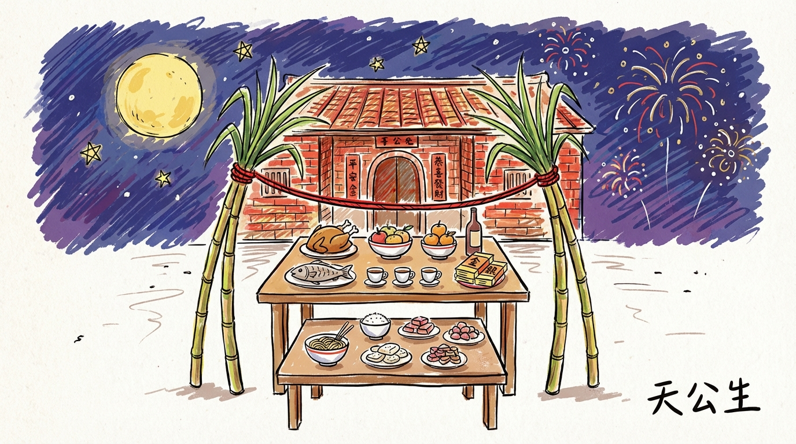
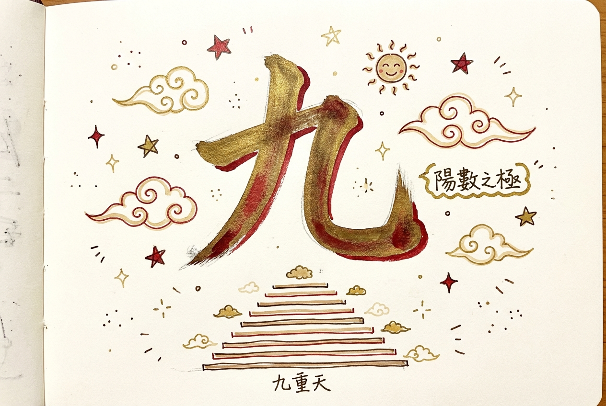
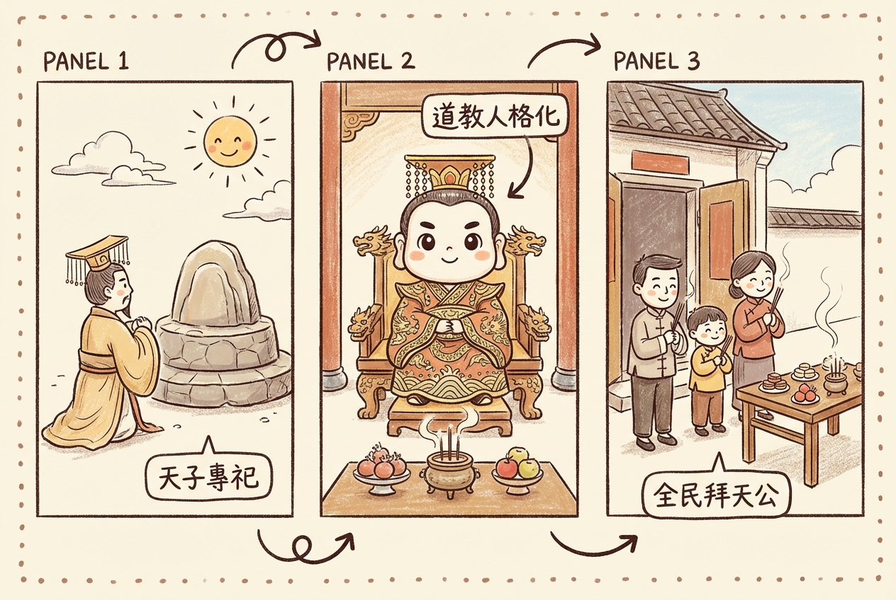
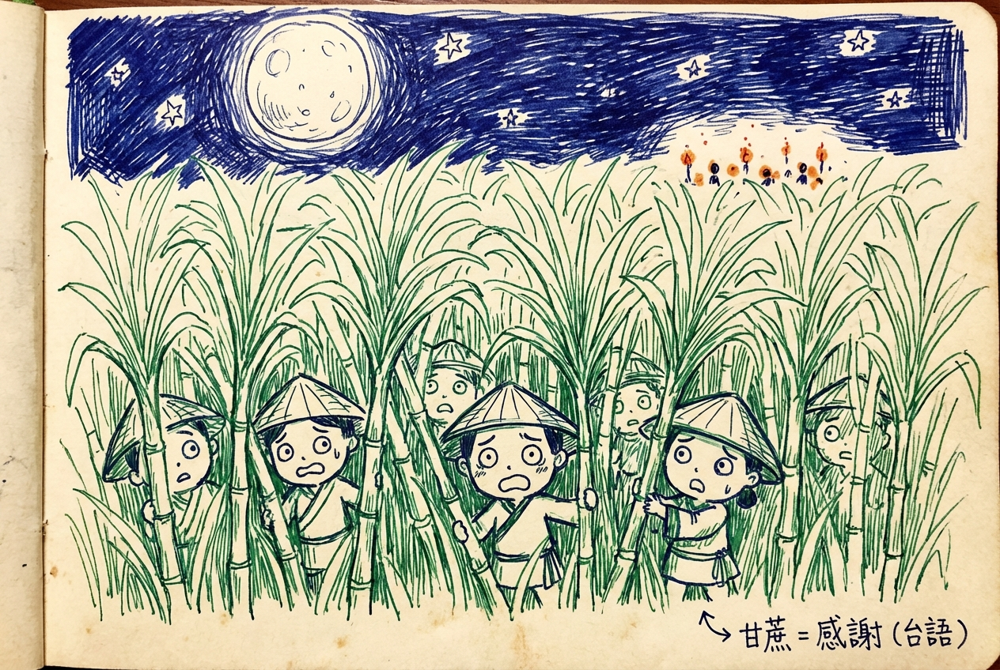
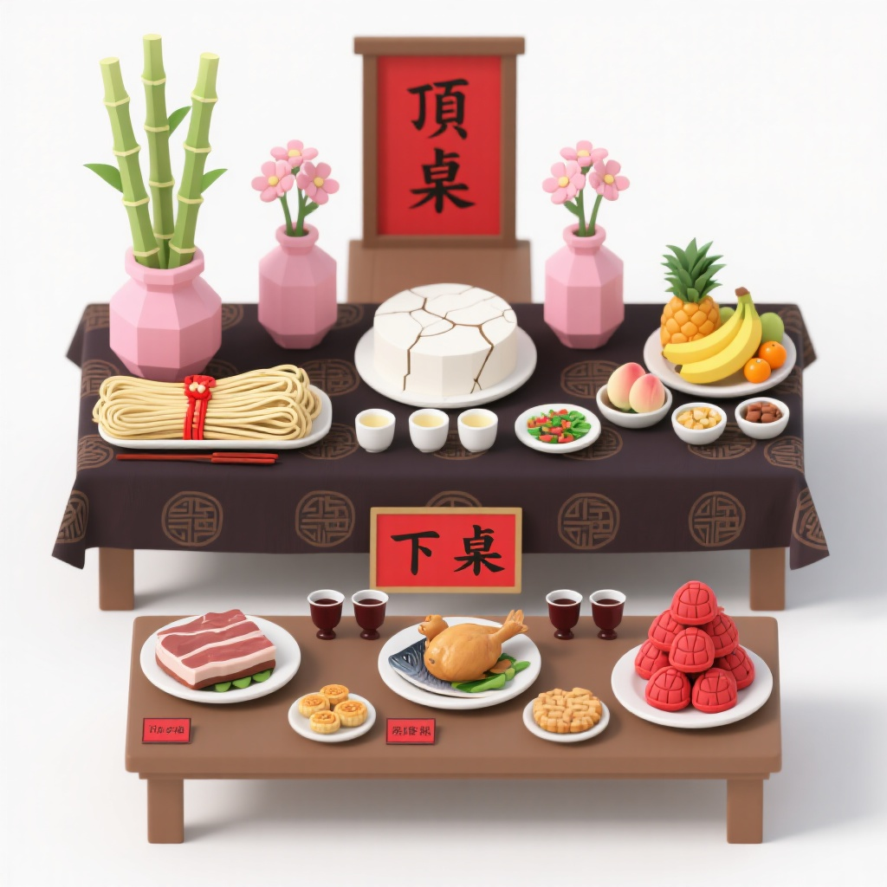
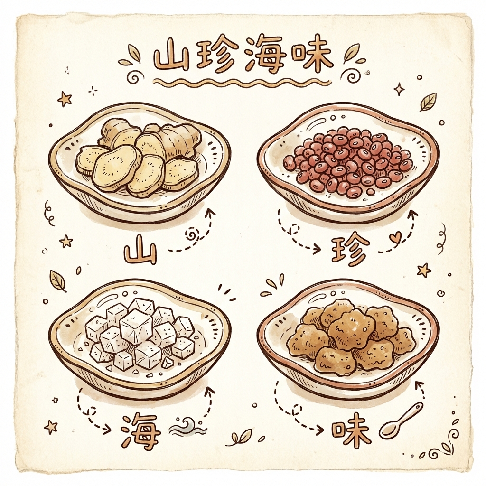
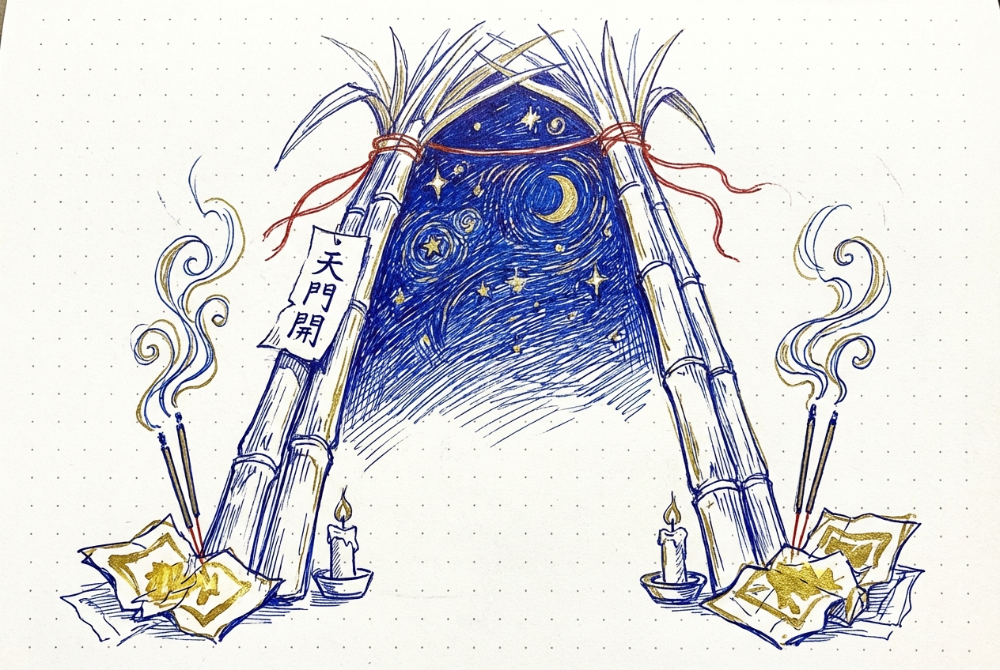
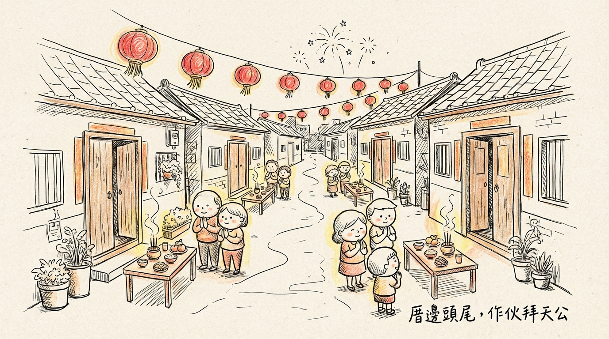

> 類型：🅱️ 文化推廣
> 系列：不一定要拜，但身為台灣人，你一定要懂。
> 素材來源：素材庫/民俗知識庫/01-节庆活动/天公生.md
> 狀態：二稿（融合由來、禁忌增強、歷史演變）
> 建立日期：2026-02-16
> 更新日期：2026-02-16

# 天公生：那個讓全台灣半夜不睡覺的日子，到底在忙什麼？

---

每年農曆正月初九，台灣有一群人會在半夜起床，甚至徹夜不眠。

他們在家門口搬出兩張桌子——一張墊得高高的，一張正常高度。高的那張只放素菜和水果，矮的那張才有雞有魚。兩根甘蔗連根帶葉立在桌子兩側，頂端用紅繩綁在一起，像一道門。黃色的鋸齒紙錢綁在甘蔗上，夜風一吹就簌簌作響。

子夜一到，全家人對著天空點香、鞠躬、說話。紅蠟燭的光映在門口，金紙的火舌往上竄。空氣裡是線香和糕點混在一起的味道。

這天是**天公生**——玉皇大帝的生日。在台灣的民間信仰裡，這是一年中規格最高、最隆重的祭典。

你可能從小跟著拜過，可能只在阿公阿嬤家遠遠看過，也可能根本不知道為什麼半夜隔壁在放鞭炮。但無論你的信仰是什麼，這件事在台灣已經流傳好幾百年了。它是這塊土地上的文化記憶，不一定要照做，但值得認識。

---

## 為什麼是正月初九？

答案藏在一個字裡：**九**。

在傳統數字觀念中，奇數為陽、偶數為陰。九是最大的陽數，象徵「至高無上」。正月是一年的開始，初九是陽數之極——最大的月份配最大的數字，用來慶祝最高神明的生日。

明初學者王逵在《蠡海集》裡寫得很清楚：「陽數始於一，而極於九，原始要終也。」數字從一開始，到九為極——用最極致的數字，配最極致的神。

不是隨便挑的日子，是整套宇宙觀算出來的。

### 還有一個更古老的傳說

民間還流傳另一套說法：農曆新年的頭幾天，每一天「管」一種生物——初一雞、初二狗、初三豬、初四羊、初五牛、初六馬、初七人。這套序列最早見於晉朝董勛的《答問禮俗說》，人們相信每天的天氣好壞，預示著那種生物全年的運勢。

初七之後呢？初八是穀日。東方朔的《占書》記到這裡就停了。

但民間自己把故事接下去了——**初九是天日，初十是地日。** 天比人更高、比穀更遠，所以排在最後，壓軸登場。天日，就成了天公的日子。

需要說明的是：「初九天日」這個說法，是後世民間對古老佔日傳統的延伸，不是原始典籍裡就有的。但正因為它是台灣人自己「接」出來的故事，反而更能看出民間信仰的生命力——不只是被動接受經典，而是主動創造意義。

---

## 玉皇大帝是怎麼來的？一段從宮廷走入民間的旅程

今天台灣人拜的「天公」，其實不是從來就長這樣的。

最早，「天」是一個抽象的概念——沒有臉、沒有名字、沒有生日。先秦到漢朝的「祭天」，是天子的專屬權利，老百姓不能拜。那時候的天，更接近「宇宙運行的法則」，而不是一個會聽你說話的神明。

轉折點在唐朝和宋朝。道教把這個抽象的「天」人格化了，給了他一個名字——玉皇大帝，給了他一個朝廷——天庭，給了他生日——正月初九，甚至給了他部屬——天兵天將。宋真宗還加封了一個超長的封號，把玉皇的地位推到最高。

到了明清時期，這個原本只有皇帝能祭祀的「天」，終於走進了尋常百姓家。閩南人把他帶到了台灣，發展出了我們今天看到的天公生——頂桌下桌、甘蔗天門、半夜子時開拜。

**從「天子獨拜的天」到「每個台灣家庭門口的天公」，花了兩千多年。** 這條路，就是一部民間信仰的民主化歷史。

---

## 甘蔗為什麼要連根帶葉？一段逃命的故事

天公生的供桌上，最顯眼的就是那兩根甘蔗。不是砍成段的那種，是**從根到尾帶著葉子的整根甘蔗**，立在桌子兩旁像兩根柱子。

為什麼？

民間流傳兩個版本的故事。一說是唐朝末年，黃巢軍南侵福建，閩南人倉皇逃命，躲進了路邊的甘蔗園裡。密密麻麻的甘蔗林遮住了他們的身影，一直躲到正月初九才脫險。另一說是明朝年間，倭寇入侵福建沿海，鄉民同樣是在除夕逃入甘蔗林，正月初九才平安出來。

兩個版本細節不同，但核心一樣：**閩南人躲進甘蔗園，靠甘蔗活了下來。**

劫後餘生的人們抬頭感謝上天庇佑，於是每年正月初九以連根帶葉的甘蔗來拜天公——「甘蔗」的閩南語發音和「感謝」相近，帶葉帶根象徵「有頭有尾」、「節節高升」。

從此，每年天公生的供桌兩側都有甘蔗。不是裝飾，是感恩。

---

## 兩張桌子的秘密：一套藏在供桌裡的宇宙觀

天公生最獨特的地方，是那個「頂桌」和「下桌」的設置。

你去看任何一個有在拜天公的家庭，門口一定是兩張桌子——上面那張墊得很高（用長板凳或金紙箱架起來），鋪著紅布；下面那張就是一般的桌子高度。

上面那張桌子叫「頂桌」，只放素食：水果、麵線、齋菜、茶。下面那張叫「下桌」，擺的是三牲五牲、雞鴨魚肉、酒。

為什麼要這樣分？

**因為頂桌拜的是天公本尊，下桌拜的是天公的部屬——天兵天將。**

對最高的天神，用最清淨的方式招待。不上酒、不殺生、不帶血腥。用素果、清茶、鮮花，安安靜靜地表達最高等級的恭敬。

下桌就不一樣了。大魚大肉、酒，像在犒賞軍隊。天兵天將整年在各處守護人間，初九這天，用豐盛的食物表達感謝——你們辛苦了，來，吃好的。

一個供桌，兩個層次。上面是「敬天」，下面是「謝兵」。合在一起，是一整套關於宇宙秩序的想像：天公在最高處，部屬在下方，各有各的位置、各有各的待遇。

這不是亂擺的。是老祖宗把「天地之間有秩序」這件事，用幾張桌子、幾道菜具體化出來了。

---

## 四碟小東西：最有台灣味的「山珍海味」

天公生供桌上有一個容易被忽略的小細節：頂桌上會擺四個小碟子——薑、紅豆、鹽、糖。

這四樣東西有個很美的名字：**山珍海味**。

等等——薑和鹽算什麼山珍海味？

這就是台灣民間信仰裡最可愛的地方了。四個字，各對一物：

**山**——薑，長在山裡土中，外型如小山丘。
**珍**——紅豆，顆粒飽滿、色澤紅潤，宛如珍貴寶石。
**海**——鹽，海水的結晶精華。
**味**——糖，帶來甜美滋味，寓意「苦盡甘來」。

過去的農村，不是家家戶戶都負擔得起真正的山珍海味。但拜天公又是最高規格的祭典，不能沒有。怎麼辦？就用四個最樸素的東西，一字一物，拼出「山海之間最珍貴的資源」。

不是買不起好東西，是「用最誠實的方式，拿出我所擁有的」。

這個做法是有據可查的台灣傳統。不是偷工減料，是一種智慧——在資源有限的年代，用心意取代價格。

---

## 為什麼半夜拜？

很多人小時候的記憶裡，天公生就是「被叫起來」的那個夜晚。半夜十一點，正睡得香，被媽媽搖醒：「來，拜天公了。」

為什麼不能早上拜？

因為農曆的新一天是從子時開始的——也就是夜裡十一點。初八的子時，就是初九的第一刻。

在天公生日到來的**第一個時刻**就祝壽，表達的是「最搶先的敬意」。不是等到天亮才想到，是時間一到，馬上恭賀。

民間還相信，子時是**天門大開**的時候。這個概念在道教傳統中有跡可循——特定時辰天地之間的通道會開啟，凡人的祈願更容易上達天聽。天公生的子時，被認為是一年中天門開啟最完整、最隆重的一次。

那兩根綁在一起的甘蔗，頂端用紅繩連成拱形，就叫「甘蔗天門」。不只是裝飾，是象徵——在自家門口搭一道通往天庭的門，讓香火和心意可以直達天公面前。

所以半夜拜天公，不是因為「規定」，是因為想在第一時間、在天門最開的時刻，把心意送上去。

---

## 燈座的學問：黃色是天公的，三色是三界公的

如果你去傳統市場買天公生的用品，可能會看到兩種燈座——一種是單一黃色的，一種是三色一組的。

它們不是同一位神的。

**黃色的燈座**是天公燈座，放在頂桌正中央、最高處，代表玉皇大帝的座位。一座，而且必須是全場最高的。

**三色的燈座**是三界公燈座，三座一排，代表天官、地官、水官三位大帝。這是上元、中元、下元節日用的，不是天公生專用。

很多人會搞混。買錯了怎麼辦？不會出大事——心誠最重要。下次買對的就好，跟天公和三界公簡單稟告一聲就行。

分辨口訣很簡單：**看顏色、看高度。黃色最高單一座，那是天公的；多色三座一排，那是三界公的。**

---

## 那些小小的禁忌，背後都有邏輯

天公生有些禁忌，乍聽之下有點奇怪：

**初八晚到初九不能曬女性內衣褲。** 為什麼？因為祭壇面向天空，晾在外面的內衣褲會「擋在天公面前」，被認為是不敬。

**番茄和芭樂不能拿來拜。** 為什麼？它們的籽會隨排泄排出，傳統上認為不潔。釋迦外型似佛頭，也不適合。

**頂桌絕對不放葷食。** 紅龜粿呢？龜的外型是動物造型，也要放下桌。

**這天不能口出穢言。** 有些長輩說「天公生日罵髒話，窮一整年」——雖然誇張了點，但背後的想法是：最尊貴的日子，說話要乾淨。

**不能說「死」字。** 大吉的日子避不吉利的字眼，「愛死你了」、「笑死」這類口頭禪也盡量避免。

**不能隨便發毒誓。** 民間相信天公生日發的誓最靈驗，所以這天說的每句話都「算數」——情侶間開玩笑的海誓山盟也要小心。

**不能用手指天。** 天公在天上巡視人間，指天等於指著天公的鼻子，大不敬。

還有一個容易被忽略的：**下桌的雞有規矩。** 要用閹公雞，禁用鳳頭雞、白毛雞和母雞。至於為什麼——傳統上認為鳳頭雞、白毛雞外觀不端正，母雞則因經期被視為不潔。

拜天公之前，全家人要**沐浴淨身、穿著整齊端莊**。紅色或喜氣顏色最好，不穿黑色、不穿破舊衣物、不赤腳、不穿拖鞋。

聽起來像一堆規矩，但如果你想一下就會發現：這些禁忌的核心邏輯就是一個字——**敬**。因為覺得天公很重要、很尊貴，所以才在乎這些細節。說話要乾淨、穿著要端正、食物要講究、動作要恭敬——全部指向同一件事。

不是恐嚇，是在意。

---

## 台灣各地的天公生：同一個節日，不同的溫度

天公生在全台灣都拜，但有些地方特別熱鬧。

**台南**是天公生的重鎮。台南天壇（俗稱天公廟）和開基玉皇宮，初八晚上就人山人海。信眾從深夜排到天亮，金紙用量驚人，部分家庭還會用折成元寶的「盆金」堆疊成塔。台南人拜天公的認真程度，在全台灣數一數二。

**鹿港**的老店鋪和傳統家庭，到現在還維持完整的頂桌下桌規制。金紙的種類、用量、擺放，講究到外地人可能會嚇一跳。

**新竹**都城隍廟周邊的聚落也保有濃厚的天公生傳統。高雄、嘉義的閩南族群聚居區同樣重視。

同一個節日，在不同的城市有不同的表情。但走進任何一個正在拜天公的家庭門口，你聞到的那個線香和糕點混合的味道，是一樣的。

---

## 現代的天公生：變與不變

住大樓的人越來越多，門口擺不下兩張桌子了。環保意識抬頭，有些廟宇開始推行「以米代金」。年輕一代可能不知道刈金和壽金的差別，但還是會在初九那天打電話回家問：「媽，今年天公生你有拜嗎？」

形式在簡化，但那個「覺得應該要做點什麼」的感覺還在。

有人在陽台擺一張小桌子、三杯茶、幾盤水果，窗戶打開面向天空。有人直接去廟裡拜。有人只是在心裡默默說一句「天公保庇」。

不管做多少，那個「抬頭看天、心存感謝」的動作，幾百年來沒有變過。

---

## 拜不拜是信仰，懂不懂是文化

天公生這件事，你可以有很多立場。

你可能是虔誠的信徒，每年初八晚上準時設壇。你可能是其他宗教的信仰者，不會參與這個儀式。你也可能什麼都不信，覺得這些都是過時的習俗。

都沒關係。

但如果你是在這塊土地上長大的人，知道每年正月初九有一群台灣人會半夜起來、對著天空彎腰、在門口點火燒金紙——知道他們為什麼這樣做、那兩張桌子代表什麼意思、甘蔗為什麼要連根帶葉——這件事本身，就是一種文化的傳承。

它不要求你相信，只是邀請你了解。

因為這些故事、這些做法、這些深夜裡的火光和線香，都是台灣的一部分。

而你，也是。

---

> 🙏 **今年想試著拜天公？這裡有完整的供品清單和步驟教學：**
> 👉 [天公生怎麼拜才對？供品、流程、禁忌完整指南](天公生-懶人包.md)

---

*本文內容經事實查核，對照明初王逵《蠡海集》、晉朝董勛《答問禮俗說》、東方朔《占書》、國史館台灣文獻館民俗辭典、台南天壇祭祀傳統、鹿港民俗文化、民俗亂彈等資料。*
